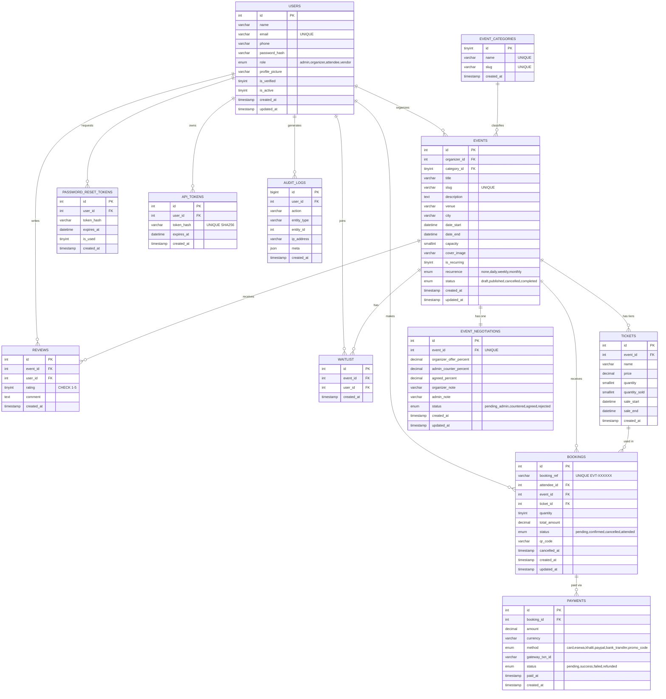
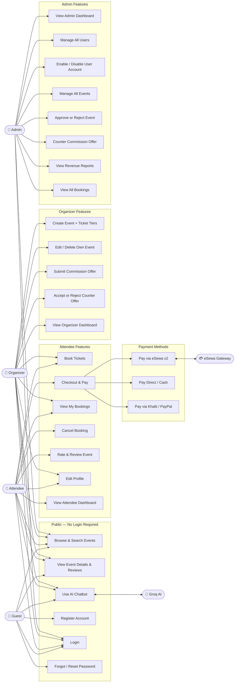
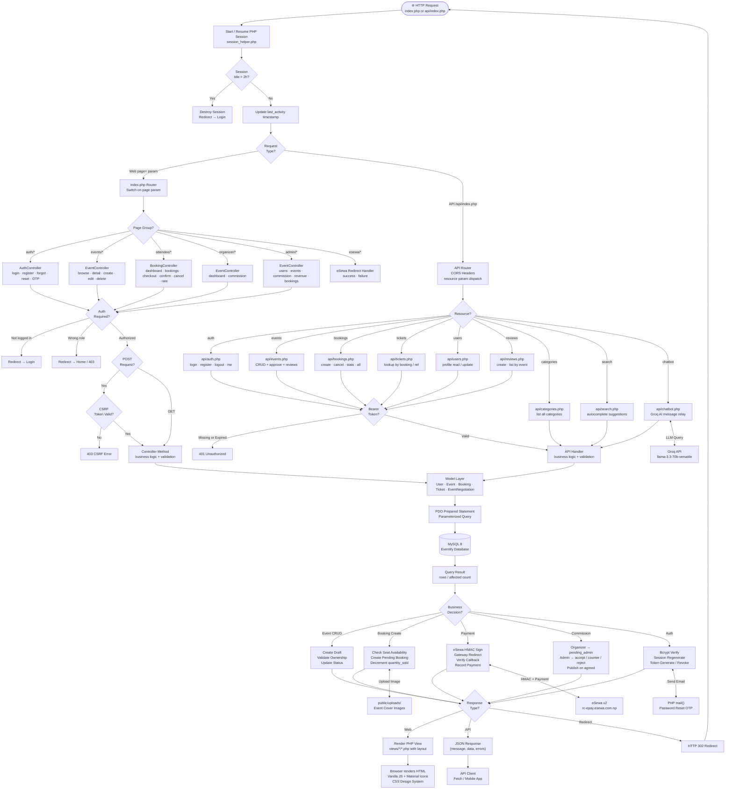

# Eventify — System Diagrams

> Auto-generated from codebase analysis. Render with any Mermaid-compatible viewer
> (GitHub, VS Code Mermaid Preview, Notion, Obsidian, etc.)

---

## Table of Contents

1. [Project Summary](#1-project-summary)
2. [Main Modules](#2-main-modules)
3. [Actors](#3-actors)
4. [Database Entities](#4-database-entities)
5. [ERD — Entity Relationship Diagram](#5-erd--entity-relationship-diagram)
6. [Use Case Diagram](#6-use-case-diagram)
7. [Activity Diagram](#7-activity-diagram)
8. [System Flowchart](#8-system-flowchart)

---

## 1. Project Summary

**Eventify** is a full-stack PHP/MySQL event management platform with role-based access control, a
commission negotiation workflow between organizers and admins, eSewa v2 payment integration, and a
Groq-powered AI chatbot. The app uses an MVC pattern with a single front controller (`index.php`),
PDO for database access, CSRF protection, bcrypt password hashing, and both session-based (web)
and token-based (API) authentication.

---

## 2. Main Modules

| # | Module | Description |
|---|--------|-------------|
| 1 | **Authentication** | Register, login, password reset via OTP, session & API token management |
| 2 | **Event Management** | Create/edit/delete events, admin approval, status lifecycle |
| 3 | **Commission Negotiation** | Organizer-Admin negotiation of platform fee before event goes live |
| 4 | **Ticket & Booking** | Ticket tiers, seat tracking, booking lifecycle |
| 5 | **Payment Processing** | Direct, eSewa v2 (HMAC-SHA256), Khalti, PayPal, Bank Transfer |
| 6 | **Search & Discovery** | Full-text MySQL search, category filtering, live autocomplete |
| 7 | **Reviews & Ratings** | 1–5 star ratings, comments, one review per attendee per event |
| 8 | **Analytics & Reporting** | Role-aware dashboards, revenue reports, bar charts |
| 9 | **AI Chatbot** | Groq LLM (llama-3.3-70b) for customer support |
| 10 | **REST API** | Token-authenticated JSON API for all core resources |

---

## 3. Actors

| Actor | Role | Key Capabilities |
|-------|------|-----------------|
| **Guest** | Unauthenticated visitor | Browse events, search, view details, register, login |
| **Attendee** | Registered user | Book tickets, pay, cancel bookings, rate events, view dashboard |
| **Organizer** | Event creator | Create/manage own events, negotiate commission, view revenue stats |
| **Admin** | Platform administrator | Approve/reject events, manage all users, view all bookings & revenue |
| **Vendor** | Future role | Defined in schema, not yet implemented |
| **Groq AI** | External AI service | Powers the chatbot assistant |
| **eSewa Gateway** | Payment processor | Handles eSewa v2 payment flow with HMAC verification |

---

## 4. Database Entities

12 tables: `users`, `event_categories`, `events`, `tickets`, `bookings`, `payments`,
`waitlist`, `reviews`, `password_reset_tokens`, `api_tokens`, `event_negotiations`, `audit_logs`

---

## 5. ERD — Entity Relationship Diagram

---

## 6. Use Case Diagram

---

## 7. Activity Diagram

```mermaid
flowchart TD
    Start(["🚀 User Visits Eventify"])

    Start --> Home["View Homepage\n— Featured Events —"]
    Home --> IsAuth{Logged In?}

    IsAuth -->|No| AuthOpt{"Choose\nAction"}
    AuthOpt -->|Register| RegForm["Fill Registration Form\nname · email · phone · password · role"]
    RegForm --> ValidReg{Input Valid?\nEmail unique?}
    ValidReg -->|No - show errors| RegForm
    ValidReg -->|Yes| HashPwd["Hash Password\nbcrypt cost=12"]
    HashPwd --> SaveUser["Insert User\nis_verified=0 is_active=1"]
    SaveUser --> LoginPage["Redirect → Login"]

    AuthOpt -->|Login| LoginPage
    LoginPage --> Credentials["Submit Email + Password"]
    Credentials --> ValidCreds{Credentials\nValid?}
    ValidCreds -->|No| LoginPage
    ValidCreds -->|Yes| GenSession["Regenerate Session ID\nSet user_id · role · name · email"]
    GenSession --> RoleRoute{Role?}
    RoleRoute -->|Admin| AdminDash["Admin Dashboard"]
    RoleRoute -->|Organizer| OrgDash["Organizer Dashboard"]
    RoleRoute -->|Attendee| BrowseEvents

    AuthOpt -->|Browse anyway| BrowseEvents

    AuthOpt -->|Forgot Password| ForgotForm["Enter Email Address"]
    ForgotForm --> GenToken["Generate Reset Token\nSend Email with Link"]
    GenToken --> OTPVerify["Verify OTP"]
    OTPVerify --> ResetForm["New Password Form"]
    ResetForm --> UpdatePwd["Hash & Save Password\nMark Token Used"]
    UpdatePwd --> LoginPage

    IsAuth -->|Yes| BrowseEvents
    BrowseEvents["Browse Published Events\n— 6 per page —"]
    BrowseEvents --> SearchFilter{Apply\nFilters?}
    SearchFilter -->|Category / City / Text| FilteredList["Filtered Results\nFull-text MySQL Search"]
    SearchFilter -->|No filter| EventList["Event Card List"]
    FilteredList --> EventList

    EventList --> PickEvent["Select an Event"]
    PickEvent --> EventDetail["View Event Detail\nTickets · Venue · Reviews · Rating"]

    EventDetail --> WantBook{Book\nTickets?}
    WantBook -->|No| BrowseEvents

    WantBook -->|Yes| AuthForBook{Authenticated?}
    AuthForBook -->|No| LoginPage
    AuthForBook -->|Yes| SelectTier["Select Ticket Tier & Quantity\nmax 5 per order"]

    SelectTier --> SeatsOK{Seats\nAvailable?}
    SeatsOK -->|No| Waitlist["Join Waitlist"]
    Waitlist --> BrowseEvents

    SeatsOK -->|Yes| Checkout["Checkout Page\nOrder Summary + Total"]
    Checkout --> PayChoice{Payment\nMethod?}

    PayChoice -->|Direct / Cash| DirectConfirm["Create CONFIRMED Booking\nDecrement quantity_sold"]

    PayChoice -->|eSewa| CreatePending["Create PENDING Booking\nReserve Seats"]
    CreatePending --> HMACSign["Generate HMAC-SHA256\nSignature + Params"]
    HMACSign --> EsewaRedirect["Redirect → eSewa\nPayment Gateway"]
    EsewaRedirect --> EsewaResult{Payment\nOutcome?}

    EsewaResult -->|Failure| CancelPending["Cancel Pending Booking\nRestore Seats"]
    CancelPending --> Checkout

    EsewaResult -->|Success| VerifyHMAC["Verify Response\nHMAC Signature"]
    VerifyHMAC --> HMACOk{Signature\nValid?}
    HMACOk -->|No| CancelPending
    HMACOk -->|Yes| VerifyAPI["Confirm Status with\neSewa API"]
    VerifyAPI --> APIConfirmed{Gateway\nConfirmed?}
    APIConfirmed -->|No| CancelPending
    APIConfirmed -->|Yes| DirectConfirm

    DirectConfirm --> RecordPayment["Record Payment\ngateway_txn_id · method · status=success"]
    RecordPayment --> GenRef["Generate Booking Ref\nEVT-XXXXXX"]
    GenRef --> GenQR["Generate QR Code"]
    GenQR --> ConfirmPage["Booking Confirmation Page\nRef · QR · Event Details"]

    ConfirmPage --> PostActions{Next Action?}
    PostActions -->|View All Bookings| MyBookings["My Bookings\nUpcoming / Past Tabs"]
    PostActions -->|Browse More| BrowseEvents

    MyBookings --> BookingAction{Action?}
    BookingAction -->|Cancel| CancelBooking["Update status=cancelled\ncancelled_at = NOW()"]
    CancelBooking --> MyBookings

    BookingAction -->|Review| EventDone{Event\nCompleted?}
    EventDone -->|No - can't review yet| MyBookings
    EventDone -->|Yes| RateForm["Rate & Review Form\n1-5 Stars + Comment"]
    RateForm --> SubmitReview["Save Review\nOne per attendee per event"]
    SubmitReview --> MyBookings

    OrgDash --> OrgActions{Action?}
    OrgActions -->|Create Event| EventForm["Event Creation Form\ntitle · venue · date · tickets · image"]
    EventForm --> ValidEvent{Valid?}
    ValidEvent -->|No| EventForm
    ValidEvent -->|Yes| SaveDraft["Save Event status=draft\nCreate EVENT_NEGOTIATIONS\nstatus=pending_admin"]
    SaveDraft --> AwaitAdmin["Awaiting Admin Review"]

    OrgActions -->|Edit or Delete| ManageOwn["Edit or Delete Own Events\nOwnership Verified"]
    ManageOwn --> OrgDash

    OrgActions -->|Commission| CommStatus["View Negotiation Status"]
    CommStatus --> OrgDecision{Admin\nCountered?}
    OrgDecision -->|Yes - Accept| OrgAccept["Accept Counter Offer\nstatus=agreed → event published"]
    OrgDecision -->|Yes - Reject| OrgReject["Reject Counter\nstatus=rejected"]
    OrgAccept --> OrgDash
    OrgReject --> OrgDash

    AdminDash --> AdminActions{Action?}

    AdminActions -->|Review Commissions| CommList["View Commission Offers\npending_admin queue"]
    CommList --> AdminDecision{Decision?}
    AdminDecision -->|Accept| AcceptComm["agreed_percent saved\nEvent → status=published"]
    AdminDecision -->|Counter| CounterOffer["Set admin_counter_percent\nstatus=countered\nNotify Organizer"]
    AdminDecision -->|Reject| RejectComm["status=rejected\nEvent → cancelled"]

    AcceptComm --> AdminDash
    CounterOffer --> AwaitAdmin
    RejectComm --> AdminDash

    AdminActions -->|Manage Users| UserList["User List\nSearch by name / email / role"]
    UserList --> ToggleUser["Enable / Disable Account\nis_active toggle"]
    ToggleUser --> AdminDash

    AdminActions -->|Manage Events| AllEvents["All Events Table\nFilter by status / category"]
    AllEvents --> EventOps["Edit · Delete · Approve"]
    EventOps --> AdminDash

    AdminActions -->|Revenue Report| RevenueChart["Revenue by Event\nBar Chart + Table"]
    RevenueChart --> AdminDash

    End(["🔚 Logout / Session Expires"])
    MyBookings -.->|Logout| End
    OrgDash -.->|Logout| End
    AdminDash -.->|Logout| End
```

---

## 8. System Flowchart

---

*Generated on 2026-05-19 — Eventify Event Management System*
